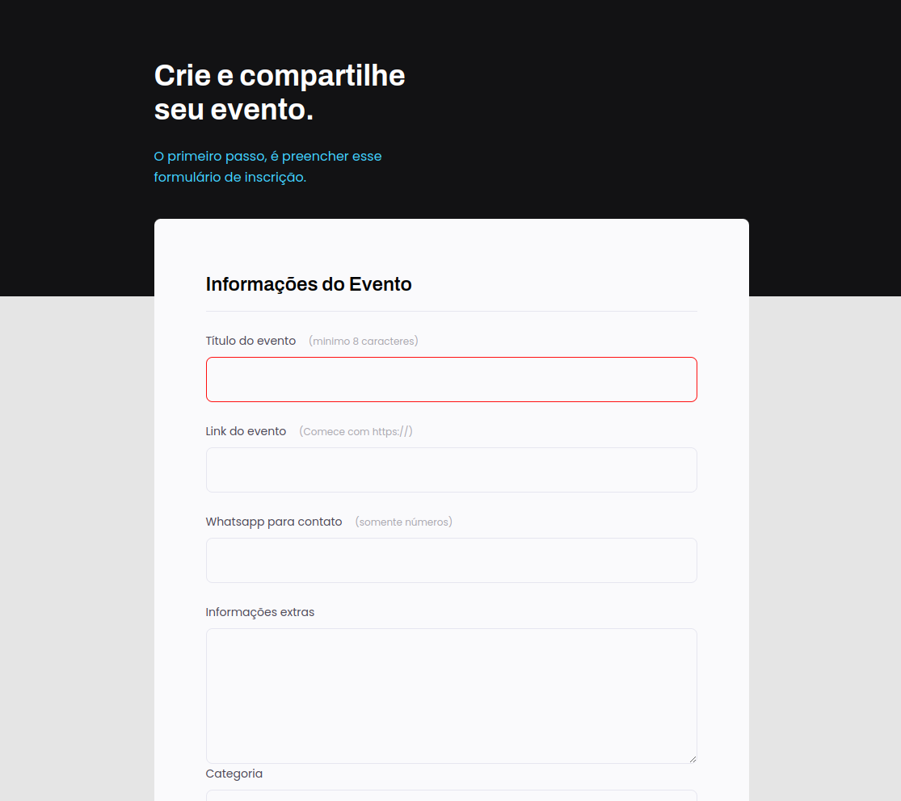

# Create Your Event

This project is a simple web application that allows users to easily create and share events by filling out a form with the necessary information.



## Table of Contents

- [Overview](#overview)
- [Technologies Used](#technologies-used)
- [Installation](#installation)
- [Usage](#usage)
- [Contributing](#contributing)
- [License](#license)
- [Contact](#contact)

## Overview

The goal of this project is to provide a user-friendly interface for creating and sharing events. Users can fill out a form with event details including title, link, contact information, category, privacy, and schedule.

## Technologies Used

- HTML5
- CSS3

## Installation

To run this project locally, follow the steps below:

1. Clone the repository:

    ```bash
    git clone https://github.com/your-username/repository-name.git
    ```

2. Navigate to the project directory:

    ```bash
    cd repository-name
    ```

3. Open the `index.html` file in your browser.

## Usage

To use the application, simply open the `index.html` file in your browser. You will see a form where you can fill in the event information and save it.

### Project Structure

- `index.html`: Main structure of the application.
- `style.css`: Styles used for the application.

### Example of Usage

1. Open `index.html` in your browser.
2. Fill out the form with the event information.
3. Click the "Save event" button to submit the form.